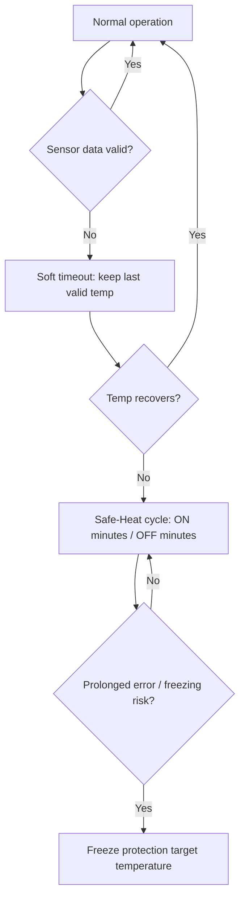

# Safety & fallback (LoS)

LoS (Loss of Sensor) / fallback exists to keep the system **predictable** if a sensor becomes unreliable.

## Visual steps (diagram)

## What you can configure

The UI typically exposes:
- Soft timeout (seconds)
- Safe‑Heat ON/OFF minutes
- Freeze‑protect target temperature

When fallback is active, the UI shows a **fallback badge** and may replace program text with a fallback label.
