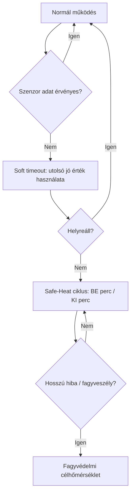

# Biztonság & fallback (LoS)

A LoS (Loss of Sensor) / fallback célja, hogy szenzorhiba esetén is **kiszámítható** maradjon a működés.

## Vizuális lépések (diagram)

## Mit lehet konfigurálni?

A UI jellemzően enged:
- Soft timeout (másodperc)
- Safe‑Heat BE/KI (perc)
- Fagyvédelmi célhőm. (°C)

Fallback alatt a UI jelvényt mutat, és a program szöveg helyett fallback státusz is megjelenhet.
